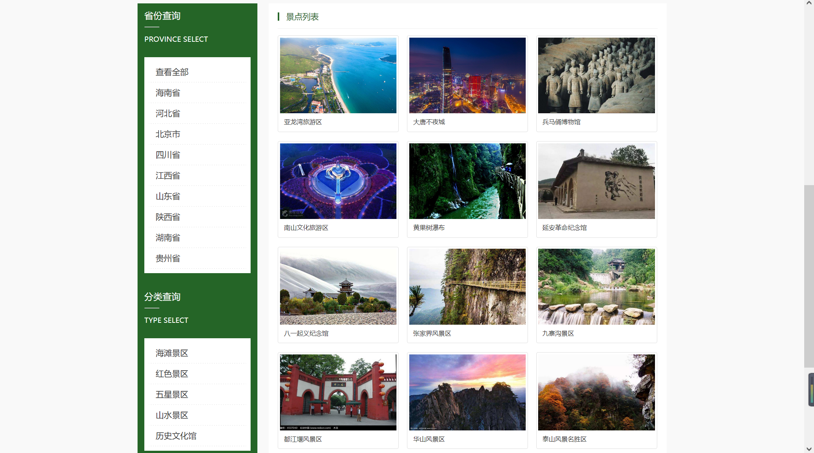
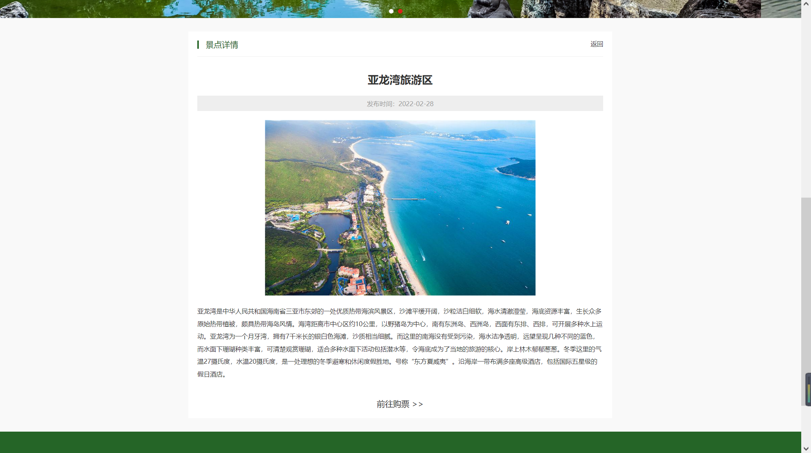
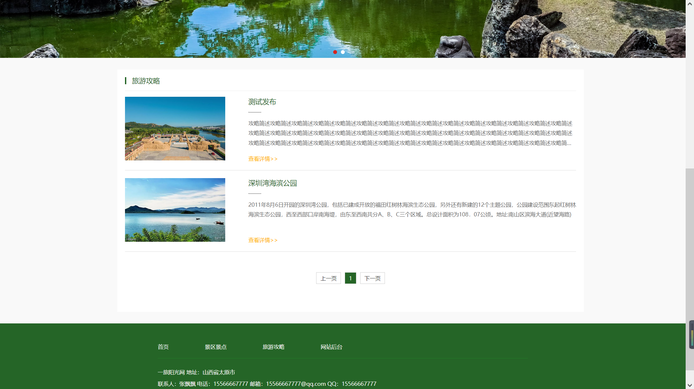
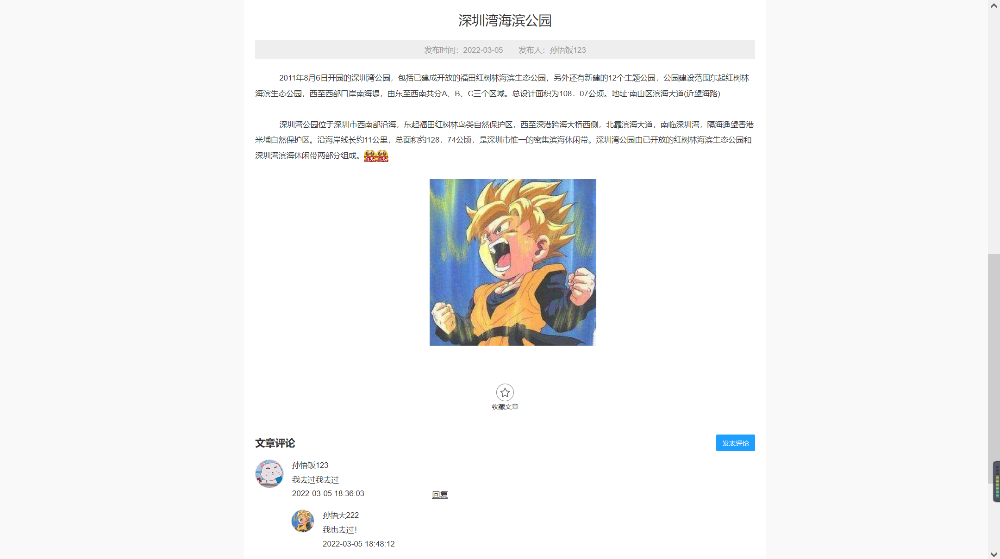
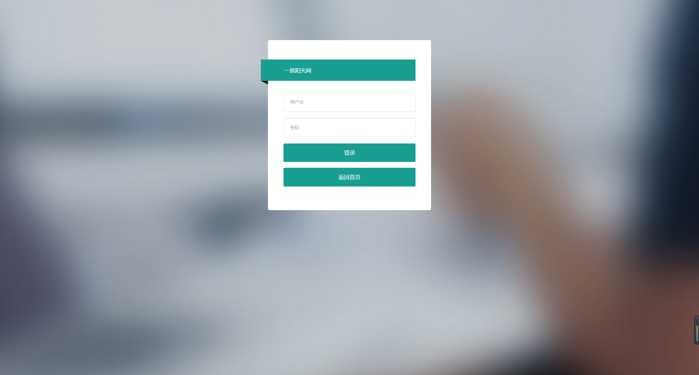
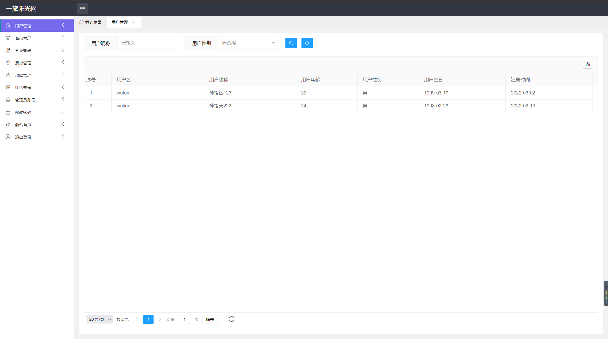
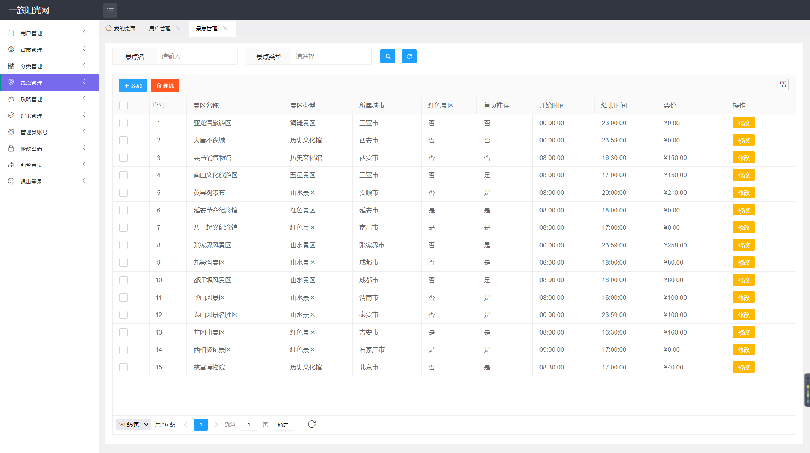
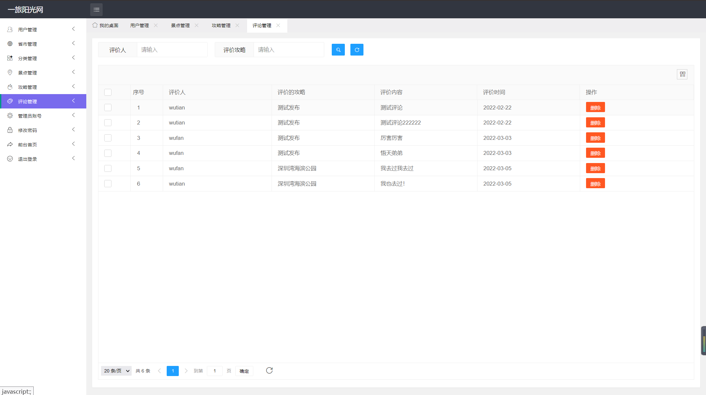

# 基于SSM的旅行社网站系统 

#### 介绍

​		随着改革开发的推进，国内的经济水平得到了飞速提高。小康家庭的数量日益增多，得到高等教育的人们几乎都坚信“读万卷书不如行万里路”，他们除了在书本中汲取知识，更愿意去看看世界的大好河山感受各地的风土人情，这也带动了国内旅游业的发展。为了让更多的人足部出户就能感受旅行带来的魅力，旅行社应该大力扶持旅游信息化管理。

```
本系统后台系统主要使用Java语言
整体架构采用：Spring + SpringMVC + MyBatisPlus + MySQL数据库
```

#### 项目设计为B/S结构，

网站包括：网站前端和网站后台。

前端为用户提供登录注册、分类筛选景区、查看景区详情、查看论坛攻略、查看浏览记录、收藏的服务。

后台进行用户管理、省份管理、景点管理、分类管理、攻略管理、评论管理、管理员管理的操作。


#### 系统技术栈

Spring + SpringMVC + MyBatisPlus + JSP + Layui + jQuery + JavaScript +  MySQL 


#### 非免费开源

#### 需要加Q：943701114，可供学生毕设参考使用，再次强调，非免费开源，非诚勿扰


#### 项目截图

##### 前台用户端截图

|  |  |
| --------------------------------------------- | --------------------------------------------- |
|  |  |
|  |  |


##### 后台管理系统截图

|  |  |
| ----------------------------------------------- | ----------------------------------------------- |
|  |  |


#### 参与贡献

1.  斗佛